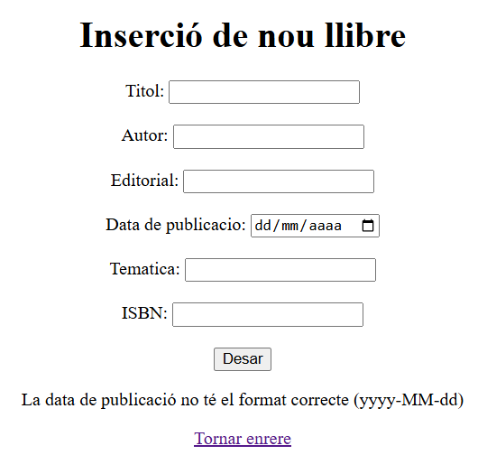
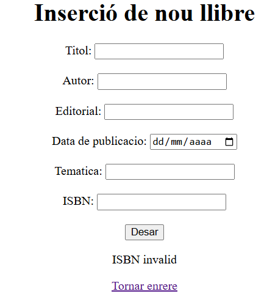
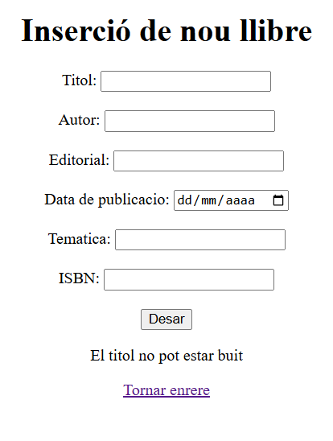
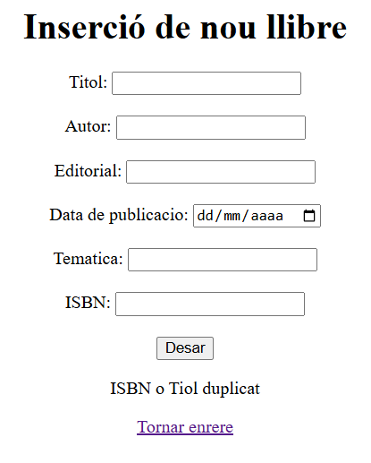
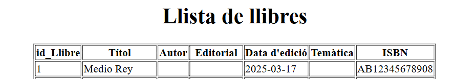
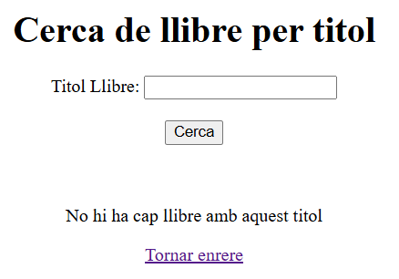
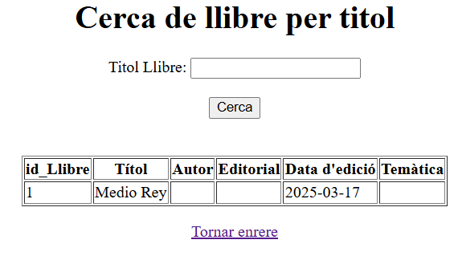
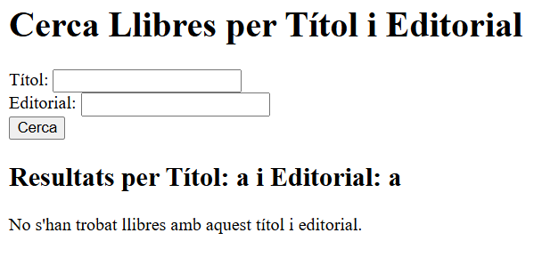
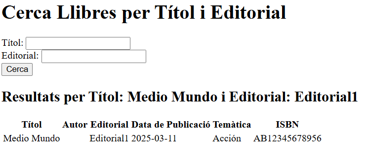

# Casos d'ús

## Inserir llibres

### Intentar posar un llibre sense data de publicació:

Aquest cas d'ús mostra què passa quan algú intenta posar un llibre a la base de dades sense posar-hi la data de publicació. El sistema hauria de dir que no i mostrar un missatge d'error, oi?

### Intentar posar un llibre amb un ISBN invàlid:

Aquest cas d'ús mostra quan algú intenta posar un llibre amb un ISBN que no està bé. El sistema ha de comprovar que l'ISBN tingui el format correcte i dir que no si no ho té, i a més, ha de donar un missatge d'error clar.

### Intentar posar un llibre sense títol:

Aquest cas d'ús ensenya quan algú intenta posar un llibre sense títol. El títol és obligatori, així que el sistema hauria de dir que no i dir que fa falta el títol, no creus?

### Intentar posar un llibre amb ISBN o Títol duplicat:

Aquest cas d'ús mostra l'intent de posar un llibre amb un ISBN o títol que ja existeix. El sistema ha d'assegurar-se que no hi hagi repes i dir que no si hi ha un duplicat, i mostrar un missatge d'error que ho expliqui.

## Consultar llibres

Aquest cas d'ús ensenya com consultar tots els llibres que hi ha a la base de dades. El sistema hauria de donar una llista completa dels llibres, amb tots els detalls.

## Consultar llibre específic amb títol

### Llibre no trobat

Aquest cas d'ús mostra què passa quan es busca un llibre per títol i no es troba res. El sistema hauria de dir que no hi ha res o dir que no s'ha trobat el llibre.

### Llibre trobat

Aquest cas d'ús mostra la cerca d'un llibre per títol que té èxit. El sistema hauria de donar el llibre que coincideix amb el títol, amb tots els detalls.

## Consultar llibre específic amb títol i editorial

### Llibre no trobat

Aquest cas d'ús demostra què passa quan es busca un llibre per títol i editorial, i no es troba cap coincidència a la base de dades.

### Llibre trobat

Aquest cas d'ús demostra què passa quan es busca un llibre per títol i editorial, i es troba una coincidència a la base de dades.

# 1. Per què al servei estem utilitzant mètodes que no hem declarat explícitament al repositori? Com és possible?

El framework JPA (Java Persistence API) pot implementar automàticament mètodes de consulta a partir del nom del mètode que poses a la interfície del repositori. Per exemple, `findByTitol(String titol)` és un mètode que JPA pot entendre i fer servir automàticament. JPA mira el nom del mètode i crea la consulta SQL corresponent.

# 2. El repositori pot triar fer l'extends de les interfícies `PagingAndSortingRepository` o de `JpaRepository`. En què es diferencien aquestes dues amb la interfície `CrudRepository`?

* **`CrudRepository`**: Aquesta interfície ofereix les operacions bàsiques per fer coses amb les dades, com crear, llegir, actualitzar i eliminar., etc.

* **`PagingAndSortingRepository`**: Aquesta interfície estén `CrudRepository` i afegeix la capacitat de fer pàgines i ordenar els resultats de les consultes.

* **`JpaRepository`**: Aquesta interfície és específica de JPA i estén `PagingAndSortingRepository`. Aporta mètodes addicionals específics de JPA, com mètodes per gestionar transaccions i altres coses relacionades amb JPA.

En resum, `CrudRepository` ofereix el bàsic, `PagingAndSortingRepository` afegeix la capacitat de fer pàgines i ordenar, i `JpaRepository` afegeix coses específiques de JPA.

# 3. Què significa `Optional<Classe>` i per a què serveix?

`Optional<Classe>` és com un contenidor que pot tenir o no un valor que no sigui nul. S'utilitza per representar que potser no hi ha un valor.

Els seus propòsits principals són:

* **Evitar el NullPointerException**: En comptes de retornar `null`, un mètode pot retornar un `Optional` buit, obligant al codi que l'utilitza a gestionar el cas en què no hi ha cap valor.

* **Indicar claredat al codi**: Fer servir `Optional` deixa clar que un mètode pot no retornar un valor, millorant la claredat del codi i reduint la possibilitat d'errors.

# 4. Per què el controlador utilitza el servei i no la seva implementació?

El controlador gestiona les peticions HTTP (rebre la petició, validar paràmetres, retornar la resposta), mentre que el servei s'encarrega de la lògica del negoci (processar les dades, accedir a la base de dades).
